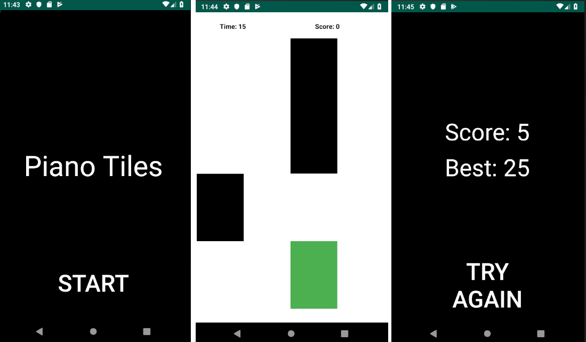

# PianoTilesProject 

A simple Piano Tiles game made with Android Studio.

* The game starts when you click START button.
* You get score by hitting the bottom black tiles and if you miss the tile you will lose the game.
* The game has a 20 second timer.
* The score is displayed after the game ends.

